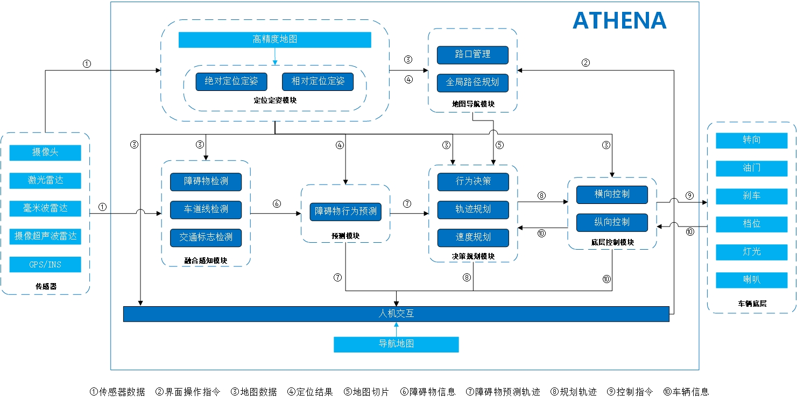
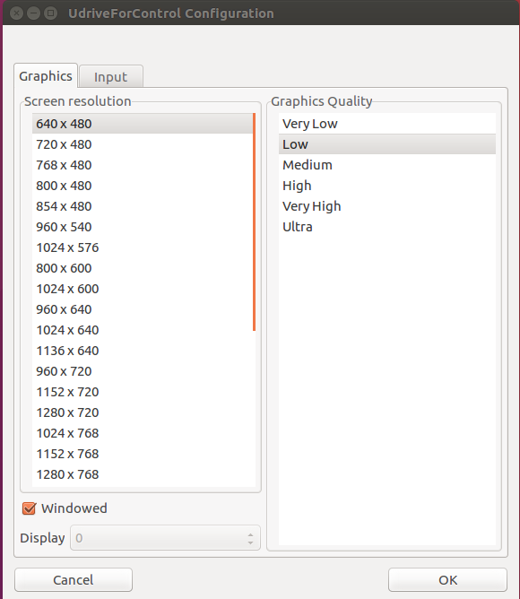
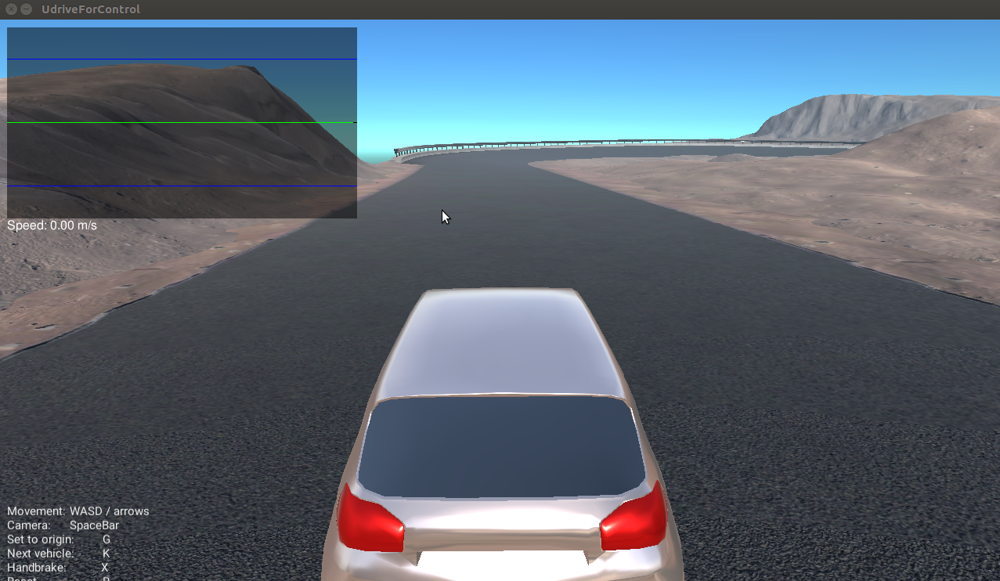
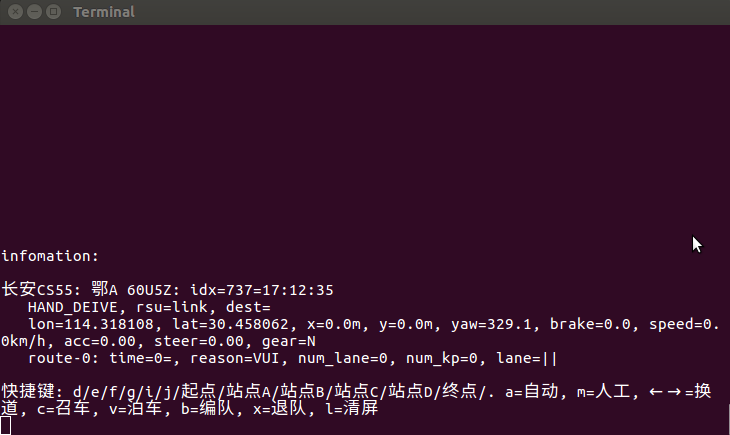
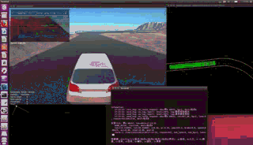
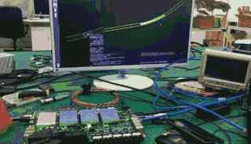

# 欢迎来到Athena
Athena（雅典娜）是环宇智行退出的开放的、轻巧灵活和高可靠的自动驾驶软件平台。Athena 1.0包含地图、导航、感知、规划、控制、仿真平台和手机app等模块，支持完整的单车自动驾驶。Athena 2.0将加入网联自动驾驶部分。  
接下来将介绍Athena的软件架构以及如何在个人pc或环宇的自动驾驶硬件平台——titan3上使用我们的Athena系统。

<!-- TOC -->

- [欢迎来到Athena](#欢迎来到athena)
    - [1. 软件架构](#1-软件架构)
        - [1.1. 核心库](#11-核心库)
        - [1.2. 实例](#12-实例)
    - [2. 使用教程](#2-使用教程)
        - [2.1. 系统要求](#21-系统要求)
        - [2.2. 安装依赖库](#22-安装依赖库)
        - [2.3. 拷贝动态库文件](#23-拷贝动态库文件)
        - [2.4. 运行仿真程序](#24-运行仿真程序)
        - [2.5. 运行自动驾驶程序](#25-运行自动驾驶程序)
            - [2.5.1. x86核下运行](#251-x86核下运行)
            - [2.5.2. arm核下运行](#252-arm核下运行)

<!-- /TOC -->

## 1. 软件架构
```
.
|-- README.md
|-- athena
|   |-- install_arm.sh
|   |-- install_x86.sh
|   |-- cc
|   |   |-- camera
|   |   |-- planning
|   |-- core
|   |   |-- arm
|   |   |-- x86
|   |-- docs
|   |   |-- readme
|   |-- examples
|   |   |-- readme
|   |   |-- LCM
|   |   |-- ROS
|   |   |-- titan3
|   |-- python
|       |-- readme
|-- data
|   |-- readme
|-- third_party
|   |-- glog-master.zip
|   |-- install.sh
|   |-- lcm-1.3.1.zip
|   |-- libsodium-1.0.3.tar.gz
|   |-- readme
|   |-- zeromq-4.1.2.tar.gz
|-- tools
    |-- readme
```

<div align=center></div>    

### 1.1. 核心库
/athena/core/目录下放置了Athena各模块的核心库文件，包括x86的库文件(/athena/core/x86)和arm的库文件(/athena/core/arm)。  
以arm/Planning为例，m目录结果如下：
```
.
|-- Planning
    |-- include
    |   |-- collision_check
    |   |   |-- collision_check.h
    |   |-- common
    |   |   |-- LocalGeographicCS.hpp
    |   |   |-- car_state.h
    |   |   |-- color_util.h
    |   |   |-- convert_coordinates.hpp
    |   |   |-- cs.h
    |   |   |-- enum_list.h
    |   |   |-- math_util.h
    |   |   |-- navi_point.h
    |   |   |-- path.h
    |   |   |-- path_tools.h
    |   |   |-- point.h
    |   |   |-- rect.h
    |   |-- map_matching
    |   |   |-- map_matching.h
    |   |-- park
    |   |   |-- park.h
    |   |-- planning
    |   |   |-- planning.h
    |   |   |-- planning_output.h
    |   |   |-- planning_param.h
    |   |   |-- route_data.h
    |   |-- spline
    |   |   |-- math_tools.h
    |   |   |-- quartic_spline.h
    |   |   |-- quintic_spline.h
    |   |   |-- spline.h
    |   |-- trajectory
    |   |   |-- trajectory.h
    |   |   |-- trajectory_sets.h
    |   |-- vehicle_dynamic
    |       |-- cau_heading_steering.h
    |       |-- circle.h
    |       |-- heading.h
    |       |-- nearest_point_on_spline.h
    |       |-- steering_angle.h
    |-- lib
        |-- libplanning.so
```
include文件夹下放置里所以头文件，lib文件夹下为arm核的动态库文件。  
  
### 1.2. 实例
/athena/examples/目录下放置了基于Athena核心库编写的实例，目前我们提供了基于LCM框架编写的x86核的实例（/athena/examples/LCM)以及适配与titan3控制器的实例（/athena/examples/titan3)。  

## 2. 使用教程
### 2.1. 系统要求
ubuntu系统
### 2.2. 安装依赖库
<table><tr><td bgcolor=#D1EEEE>cd third_party/</td></tr></table>   
<table><tr><td bgcolor=#D1EEEE>install.sh</td></tr></table> 

<font color=#A52A2A>推荐安装的第三方库的版本：</font>   
lcm : 1.3.1    
zeromq : 4.1.2     
libsodium : 1.0.3      

### 2.3. 拷贝动态库文件
进入目录
<table><tr><td bgcolor=#D1EEEE>cd athena/</td></tr></table>  
如果是在x86核上使用，运行脚本install_x86.sh  
<table><tr><td bgcolor=#D1EEEE>./install_x86.sh</td></tr></table>  
如果是在arm核上使用，运行脚本install_arm.sh  
<table><tr><td bgcolor=#D1EEEE>./install_arm.sh</td></tr></table>

### 2.4. 运行仿真程序
仿真平台需要在x86核ubuntu系统下运行  
<table><tr><td bgcolor=#D1EEEE>cd athena/examples/LCM/SIM/Unity_Sim/</td></tr></table>  
运行run  

<div align=center></div>   
     
选择分辨率和画面质量，点击OK  

<div align=center></div>    

### 2.5. 运行自动驾驶程序
#### 2.5.1. x86核下运行
<table><tr><td bgcolor=#D1EEEE>cd athena/examples/LCM/Singlecar/launch/bin/</td></tr></table>    
启动程序：运行脚本    
<table><tr><td bgcolor=#D1EEEE>./launch.sh</td></tr></table>    
找到sim_vui的终端，在终端界面上点击键盘：d/e/f/g/i/j/分别选择不同的目的地：起点/站点A/站点B/站点C/站点D/终点/    
    
<div align=center></div>    
  
程序规划出到达所选目的地的最优路线，并控制车辆按规划出的路径行驶  

<div align=center></div> 
   
关闭程序：运行脚本  
<table><tr><td bgcolor=#D1EEEE>./ds.sh</td></tr></table>    

#### 2.5.2. arm核下运行
<table><tr><td bgcolor=#D1EEEE>cd athena/examples/titan3/launch/bin/</td></tr></table>    
运行启动脚本    
<table><tr><td bgcolor=#D1EEEE>./launch.sh</td></tr></table>   
其他步骤与x86核下一致  
<div align=center></div>    
     
<font color=#A52A2A>注意：本系统支持分布式运行，如果仿真程序和自动驾驶程序不在同一台机器上运行（如仿真程序运行在个人电脑上，自动驾驶程序运行在titan3控制器上），只需保证不同机器连接在同一局域网内即可！</font>
